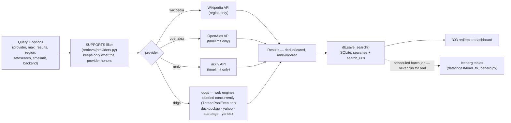

# Cloudera Blueprint: URLvestigia

## Table of Contents

- [Overview](#overview)
- [Demo](#demo)
- [Use Case](#use-case)
- [Key Features](#key-features)
- [Quickstart](#quickstart)
- [Architecture / Software Components](#architecture--software-components)
- [Target Audience](#target-audience)
- [Repository Structure](#repository-structure)
- [Prerequisites](#prerequisites)
- [Hardware Requirements](#hardware-requirements)
- [Status](#status)
- [Documentation](#documentation)

## Overview

**Natural-language text in, a governed table of URLs out.** Type a question, get a
persisted list of source links — the query, provider, engines, region, and time
window stored alongside — so a search becomes an artifact instead of an activity.
Search the web, Wikipedia, OpenAlex, or arXiv; each exposes only the options it
genuinely applies, and the record says which.

Free to run: no API keys, no accounts, no build step — the only external services it
talks to are public search-engine pages and three keyless non-profit APIs.

Retrieval, Serve, and local storage run today. The platform tier (Iceberg, Spark,
SDX) is designed against the same schema; connecting it is the next step, not a
missing one — see [Documentation](#documentation).

## Demo

No hosted demo yet. [`docs/EXAMPLE.md`](docs/EXAMPLE.md) is a runnable, ~20-minute
walkthrough of one search traced end to end — with real commands and real output at
every step.

## Use Case

Research that starts with "find me the sources on X" is done in a browser and lost in
a browser — the tabs close, the links live in someone's history, and the next person
who needs the same sources starts from zero. Nothing about which query produced which
results is recoverable.

URLvestigia turns that question into a persisted, governed table of source URLs:

- **Discovery is captured**, not just performed — the result set survives the session.
- **Provenance is explicit** — every URL carries the query and options that produced it.
- **Duplicates become signal** — a URL returned by six searches is more interesting
  than one returned once.
- **It is governed** — Ranger masks query text, Atlas carries lineage, and the
  retrieval component ships with a model card.

Full scorecard, cost, and risk breakdown: [`docs/BUSINESS_CASE.md`](docs/BUSINESS_CASE.md).

## Key Features

- **Four corpora** — web (DuckDuckGo / Yahoo / Startpage / Yandex via `ddgs`),
  Wikipedia, OpenAlex, and arXiv — each exposing only the options it genuinely
  supports.
- **Every search is a governed record** — query, provider, engines, region, time
  window, and timestamp persisted together.
- **Links only, never page content.**
- **POST-redirect-GET**, with every option whitelisted and clamped server-side.
- **Two-tier storage** — SQLite today, with an Iceberg schema and loader already
  written for the platform tier.
- **One-command local backups** (`make backup` or the Store button) — safe mid-serve,
  never overwrites a previous snapshot.
- **`make doctor`** — a pre-demo preflight that probes every provider and engine.
- **255 tests**, no network in the default run.
- **Zero cost to run** — no API keys, no accounts.

## Quickstart

Everything below runs on a laptop, with nothing provisioned.

```bash
# 1. Run the reference app (the Serve layer)
make install
make dev                 # → http://127.0.0.1:8000/

# 2. Before a live demo: is this machine actually reaching every corpus?
make doctor              # probes each provider and web engine, with latency

# 3. The Harden gate
make test                # 255 passing, 13 skipped (the live tier)
```

**Without `make`** — the Makefile needs bash, so on Windows without Git Bash or WSL
use these directly. They are the same commands the targets wrap:

```bash
python -m pip install -r app/requirements.txt -r tests/requirements.txt
python -m uvicorn app.server:app --reload --port 8000
python scripts/doctor.py
python -m pytest tests -q
```

## Architecture / Software Components



| Layer | Directory | Component | State |
|---|---|---|---|
| Serve | `app/` | FastAPI + Jinja2 dashboard | runs locally |
| AI | `retrieval/` | `text_to_urls()` metasearch | runs locally |
| Ingest | `data/ingest/` | SQLite → Iceberg batch loader | dry run only |
| Lakehouse | `data/iceberg/` | `raw_searches`, `raw_search_urls`, `curated_urls` | DDL never applied |
| Process | `pipelines/` | URL normalisation and enrichment | dry run only |
| Governance | `governance/` | Ranger policies, model card, classification | never imported |

Full layer map and the mechanism-level decisions:
[`docs/ARCHITECTURE.md`](docs/ARCHITECTURE.md).

## Target Audience

- **Analysts and researchers** who want a governed, reusable record of what was
  searched and why — reusing `curated_urls` for recurring research instead of
  re-searching from scratch.
- **Developers and solution architects** using this as a template (`make new`) to
  build their own Cloudera blueprint across the same five-layer stack.

## Repository Structure

```
URLvestigia/
├── docs/         architecture · business case          written
├── infra/        IaC — CDP CLI / Terraform             dry run, not provisioned
├── data/         SQLite dev store · Iceberg DDL         SQLite runs, Iceberg planned
├── pipelines/    Data Engineering (Spark) jobs         dry run, needs Spark
├── retrieval/    search providers · notebooks · eval   runs
├── app/          FastAPI + Jinja2 dashboard            runs
├── governance/   SDX policies · model card             written, not imported
├── tests/        data quality · retrieval eval         255 passing
├── .cicd/        build → test → deploy                 dry run
├── .github/      the same test tiers, in Actions       runs on every push
├── .gitlab/      MR + issue templates                  written
├── scripts/      doctor · new-accelerator.sh           runs
└── Makefile      make dev · make test                  runs (needs bash)
```

Each directory has its own `README.md` with more detail and naming conventions.

## Prerequisites

- Python 3 and `pip`.
- `pip install -r app/requirements.txt -r tests/requirements.txt` — or `make install`.
- `git`, and bash for the Makefile (Git Bash or WSL on Windows — see the
  [Quickstart](#quickstart)'s non-`make` fallback if unavailable).
- Nothing else: no API keys, no accounts, and no CDP entitlement for anything that
  runs today. A CDP account is only needed to exercise the dry-run platform scripts
  under `infra/` and `.cicd/` for real.

## Hardware Requirements

| Deployment | Minimum |
|---|---|
| Laptop / demo (what runs today) | Any machine that runs Python 3 — no GPU, no measured RAM floor |
| CDP / production tier | Sized in [`infra/cdp/provision.sh`](infra/cdp/provision.sh) as a demo-footprint default (e.g. CDE `m5.2xlarge`, AI Workbench `m5.xlarge`) — never validated against a real environment, see [`infra/README.md`](infra/README.md) |

## Status

**Solid at the web edge; the platform tier is designed, not deployed.** Three items
are open before this is hosted beyond `127.0.0.1`:

- No authentication and no CSRF protection — correct for localhost, wrong once served
  to anyone else.
- The retrieval model card carries no dated evaluation run.
- `ingress_cidrs` defaults to `0.0.0.0/0`.

**Query text leaves the environment** — searches go to third-party public endpoints
with no API key and therefore no data-processing agreement. Raise this first with any
customer whose data cannot leave — see
[`governance/DATA_CLASSIFICATION.md`](governance/DATA_CLASSIFICATION.md).

Full gate-by-gate detail: [`docs/GATES.md`](docs/GATES.md).

## Documentation

Start with [`docs/EXAMPLE.md`](docs/EXAMPLE.md) — the 20-minute walkthrough. From
there, [`docs/README.md`](docs/README.md) indexes the rest (architecture, business
case, gates, operating model) in the order worth reading them, plus the conventions
that keep the docs from drifting apart. Layer-specific detail —
`text_to_urls()`'s full option set, the storage/backup model — lives in
[`retrieval/README.md`](retrieval/README.md) and [`data/README.md`](data/README.md).
